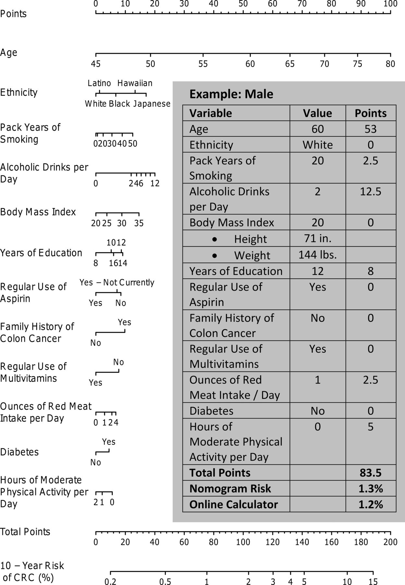
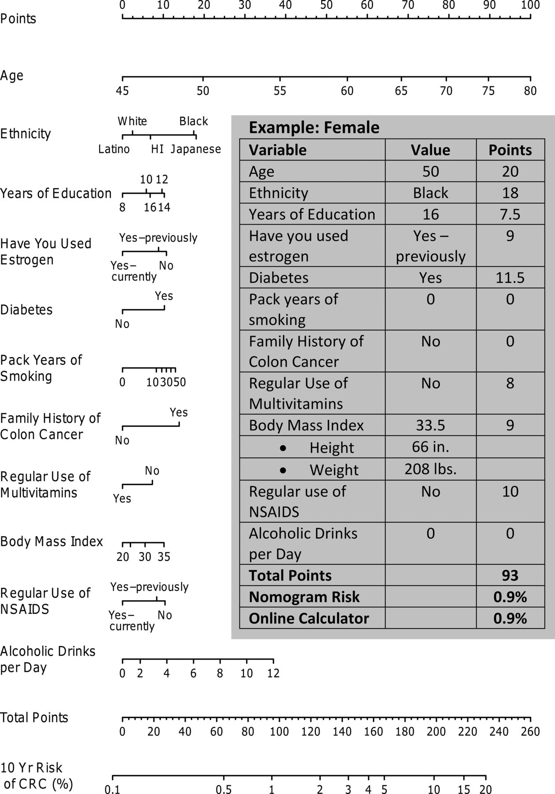

```{r setup, include=FALSE}
knitr::opts_chunk$set(echo = TRUE)
```

## Introduction

With the incidence of cancer at an all-time high, it is imperative to learn about the associated risk factors in order to be better equipped to take proactive measures. 

According to the United States National Institute of Health (NIH), an estimated 1,735,350 new cases of cancer will be diagnosed in the U.S. each year and 609,640 people will die from the disease in 2018. Given the unsettling implications of this data action is required. 

We have created a tool for researchers to build cancer prediction models. 

Our package includes basic functions that are user friendly and highly interactive. These functions will help investigators build cancer prediction models because they take into account numerous variables relevant to cancer models. 

The cancerrisk package has 5 main functions that users can incorporate into their cancer risk assessment models.

Statistics from: <https://www.cancer.gov/about-cancer/understanding/statistics>

## Functions in cancerrisk

Functions provided in the package aim to help people caluclate different health indicators and have a better idea of the health related issue

* `BMI()` calcualtes the BMI based on height and weight 

* `lungcancer()` to help people to estimate their absolute risk of getting luncaner in 5 years

* `colon_cancer_male()` to help males to estimate their risk of getting colon cancer in next ten years

* `colon_cancer_female()` to help females to estimate their risk of getting colon cancer in next ten years


## Examples of how to use the functions in cancerrisk are shown below. 

1. BMI function

```{r}
BMI=function(height, weight){
  BMI=weight/(height)^2 # weight is kg; height is meter
  return(BMI)
}
```


Based on the height and weight of a person, the user can calucalte the BMI. If the height of a person is 1.70 meter and the weight of him/her is 50kg. The BMI of him/her would be:

```{r}
BMI(1.70,50)
```

2.Lung cancer risk
```{r}
lungcancer<-function(age,sex,smoking,pneumonia,asbestos,malignant_tumour,family_history){
  if(sex==1){ #male
    if(age>=40& age<=44){a=-9.06}
    else if(age>=45& age<=49){a=-8.16}
    else if(age>=50& age<=54){a=-7.31}
    else if(age>=55& age<=59){a=-6.63}
    else if(age>=60& age<=64){a=-5.97}
    else if(age>=65& age<=69){a=-5.56}
    else if(age>=70& age<=74){a=-5.31}
    else if(age>=75& age<=79){a=-4.83}
    else if(age>=80& age<=84){a=-4.68}
  }
  else if(sex==2){ # female
    if(age>=40& age<=44){a=-9.90}
    else if(age>=45& age<=49){a=-8.06}
    else if(age>=50& age<=54){a=-7.46}
    else if(age>=55& age<=59){a=-6.50}
    else if(age>=60& age<=64){a=-6.22}
    else if(age>=65& age<=69){a=-5.99}
    else if(age>=70& age<=74){a=-5.49}
    else if(age>=75& age<=79){a=-5.23}
    else if(age>=80& age<=84){a=-5.42}
  }


  if(smoking==0){b1=0}
  else if(smoking>=1&smoking<=20){b1=0.769}
  else if(smoking>=21&smoking<=40){b1=1.452}
  else if(smoking>=41&smoking<=60){b1=2.507}
  else if(smoking>60){b1=2.724}


  if(pneumonia==0){b2=0} # no
  else if(pneumonia==1){b2=0.602} #yes

  if(asbestos==0){b3=0} # no
  else if(asbestos==1){b3=0.634} # yes

  if(malignant_tumour==0) {b4=0}
  else if(malignant_tumour==1){b4=0.675}

  if(family_history==0){b5=0}
  else if(family_history<60){b5=0.703}
  else if (family_history>=60){b5=0.168}

  p=1/(1+exp(-(a+b1+b2+b3+b4+b5)))*100
  return(p)
}

```

Lung cancer is correlated with a lot of potential exposures.The model used for our package is based on parameters that include age,sex,smoking duration measured in years,prior diagnosis of pneumonia,occupational exposure to asbestos,prior diagnosis of malignant tumour,and family-history of lung cancer have a significant impact on lung cancer.People who are older than 40 years old could use this function. For example, a woman who is 65 years-old, who smoked for 37 years, diagnosed malignant tumor, and was not exposed to asbestos occupationally, whose family history of lung cancer was 70 years. The absolute risk(%) of her to get lung cancer in next 5 years, would be:

```{r}
lungcancer(65,2,37,1,0,0,70)
```


3. colon cancer risk estimation

Conlon cancer is another cancer-type that is dramatically impacted by lifestyle-associated risk factors. Because the exposures for women and men are different as reported from a study conducted by Wells et al., two functions were used in colon cancer, one for men and the other for women.
```{r}
colon_cancer_male=function(age,race,education,aspirin,diabetes,smoking,family_history,
                           multivitamins,BMI,red_meat,drinks,physical_activiites){
  if(age==45){a=0}
  else if(age>45& age<=50){a=19}
  else if(age>=51& age<=55){a=35}
  else if(age>=56& age<=60){a=53}
  else if(age>=61& age<=65){a=64}
  else if(age>=66& age<=70){a=78}
  else if(age>=71& age<=75){a=89}
  else if(age>=76& age<=80){a=100}

  if(race==1){b=0} # white
  else if (race==2){b=1} # latio
  else if (race==3){b=5} # black
  else if (race==4){b=13} # hawiian
  else if (race==5){b=15} # japanese

  if(smoking==0){c=0} #pack years of smoking
  else if(smoking>0&smoking<=20){c=2.5}
  else if(smoking>20&smoking<=30){c=5}
  else if(smoking>30&smoking<=40){c=9}
  else if(smoking>40&smoking<=50){c=11}

  if(drinks==0){d=0} #alcoholic drinks per day
  else if(drinks>0&drinks<=2){d=12.5}
  else if(drinks>2&drinks<=4){d=14}
  else if(drinks>4&drinks<=6){d=15}
  else if(drinks>6&drinks<=12){d=19}

  if(BMI==20){e=0} #BMI
  else if(BMI>20&BMI<=25){e=2}
  else if(BMI>25&BMI<=30){e=7}
  else if(BMI>30&BMI<=35){e=11}

  if(education==8){f=0} #years of education
  else if(education>8&education<=10){f=4.5}
  else if(education>10&education<=12){f=8}
  else if(education>12&education<=14){f=8.2}
  else if(education>14&education<=16){f=5}

  if(aspirin==0){g=5}# regular use  of aspirin # no
  else if(aspirin==1){g=0} # yes
  else if(aspirin==2){g=4} #yes-not currently

  if(family_history==0){h=0} #no
  else if(family_history==1){h=10} #yes

  if(multivitamins==0){i=8} # regular use of multivtamins # no
  else if(multivitamins==1){i=0} #yes

  if(red_meat==0){j=0} #onces of red meat intake per day
  else if(red_meat>0&red_meat<=1){j=2.5}
  else if(red_meat>1&red_meat<=2){j=6}
  else if(red_meat>2&education<=4){j=7.5}

  if(diabetes==0){k=0}#no
  else if(diabetes==1){k=5} #yes

  if(physical_activiites==0){l=5} #hours of moderte physical activity perday
  else if(physical_activiites>0&physical_activiites<=1){l=2}
  else if(physical_activiites>1&physical_activiites<=2){l=0}

  p=a+b+c+d+e+f+g+h+i+j+k+l # total points from different variable

  if(p<=10){risk=0.2}# covert total points into 10 years risk of CRC (%)
  else if(p>10&p<=46){risk=0.5}
  else if(p>46&p<=76){risk=1}
  else if(p>10&p<=104){risk=2}
  else if(p>46&p<=120){risk=3}
  else if(p>10&p<=132){risk=4}
  else if(p>46&p<=142){risk=5}
  else if(p>10&p<=170){risk=10}
  else if(p>46&p<=188){risk=15}
  else if(p>188){risk="larger than 15%"}

  return(risk)
}

```

```{r}
colon_cancer_female=function(age,race,education,estrogen,diabetes,smoking,family_history,
                             multivitamins,BMI,NSAIDS,drinks){
  if(age==45){a=0}
  else if(age>45& age<=50){a=20}
  else if(age>=51& age<=55){a=38}
  else if(age>=56& age<=60){a=55}
  else if(age>=61& age<=65){a=68}
  else if(age>=66& age<=70){a=79}
  else if(age>=71& age<=75){a=89.5}
  else if(age>=76& age<=80){a=100}

  if(race==1){b=2.5} # white
  else if (race==2){b=0} # latio
  else if (race==3){b=17.5} # black
  else if (race==4){b=6.5} # hawiian
  else if (race==5){b=18.5} # japanese

  if(smoking==0){c=0} #pack years of smoking
  else if(smoking>0&smoking<=10){c=6}
  else if(smoking>10&smoking<=30){c=7.5}
  else if(smoking>30&smoking<=50){c=10}

  if(drinks==0){d=0} #alcoholic drinks per day
  else if(drinks>0&drinks<=2){d=2.8}
  else if(drinks>2&drinks<=4){d=10}
  else if(drinks>4&drinks<=6){d=19}
  else if(drinks>6&drinks<=8){d=25}
  else if(drinks>8&drinks<=10){d=32}
  else if(drinks>10&drinks<=12){d=37.5}

  if(BMI==20){e=0} #BMI
  else if(BMI>20&BMI<=30){e=7}
  else if(BMI>30&BMI<=35){e=11}

  if(education==8){f=0} #years of education
  else if(education>8&education<=10){f=5.5}
  else if(education>10&education<=12){f=8}
  else if(education>12&education<=14){f=9}
  else if(education>14&education<=16){f=7.5}

  if(estrogen==0){g=9}# regular use  of aspirin # no
  else if(estrogen==1){g=0} # yes
  else if(estrogen==2){g=7.5} #yes-not currently

  if(family_history==0){h=0} #no
  else if(family_history==1){h=12.5} #yes

  if(multivitamins==0){i=7.5}# regular use of mutliviatmins # no
  else if(multivitamins==1){i=0} #yes

  if(diabetes==0){j=0}#no
  else if(diabetes==1){j=7.5} #yes

  if(NSAIDS==0){k=0} # regular use of NSAIDS #yes-currently
  else if(NSAIDS==1){k=7}#yes-previously
  else if(NSAIDS==2){k=12}#no

  p=a+b+c+d+e+f+g+h+i+j+k # total points from different variable

  if(p==0){risk=0.11} # covert total points into 10 years risk of CRC (%)
  else if(p>0&p<=64){risk=0.5}
  else if(p>64&p<=94){risk=1}
  else if(p>94&p<=126){risk=2}
  else if(p>126&p<=144){risk=3}
  else if(p>144&p<=156){risk=4}
  else if(p>156&p<=165){risk=5}
  else if(p>165&p<=197){risk=10}
  else if(p>197&p<=216){risk=15}
  else if(p>216&p<=232){risk=20}
  else if(p>232){risk="larger than 20%"}

  return(risk)
}
```

Example:

For a man who has the following conditions. The figure provided shows the weight assigned to the colon cancer risks factors used in our function colon_cancer_male function: The figure also gives an example.

```{r,echo=FALSE, out.width='100%'}

```

```{r}
colon_cancer_male(60,1,12,1,0,20,0,1,20,1,2,0)
```

Example:

For a woman who has the following conditions.The figure provided shows the weight assigned to the colon cancer risks factors used in our function colon_cancer_female function: The figure also gives an example. 

```{r,echo=FALSE, out.width='100%'}

```

```{r}
colon_cancer_female(50,3,16,2,1,0,0,0,33.5,0,0)
```


##Conclusions and Acknowledgements

The cancerrisk pacakage not only includes two  cancer risk functions but also BMI calcualtor, which is convienent for user to have a better idea about his/her health condition. The numeric models were based on two public health studies,Cassidy, Adrian, et al. "The LLP risk model: an individual risk prediction model for lung cancer." British journal of cancer 98.2 (2008): 270. and Wells, Brian J., et al. "Colorectal cancer predicted risk online (CRC-PRO) calculator using data from the multi-ethnic cohort study." The Journal of the American Board of Family Medicine 27.1 (2014): 42-55.The risk values calculated provide rough estimations for cancer risks, and can be used as a cancer risk assesment tool. This package is to be used for educational purposes only, and should not be used for diagnostic purposes. For medical advice, please consult a qualified medical provider.

We would like to thank Professor Adam J Sullivan and Isaac Zhao for their help in making meaninful suggestions in preparing the functions and overall advice regarding package development.
